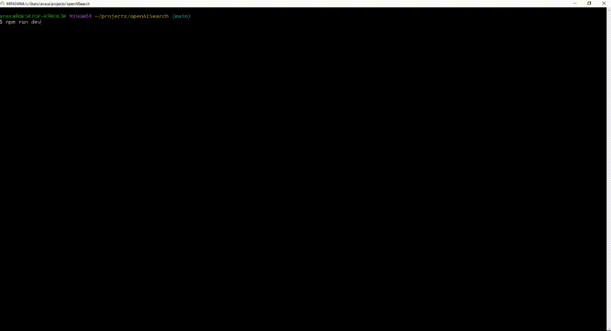

# openAISearch

CLI tool for quickly querying OpenAI

Get your OpenAI API Key [here](https://beta.openai.com/account/api-keys)

For installation

Rename Environment file and paste in your API Key

```
cp .env.example .env
```

```
npm install
```

For Execution

```
npm run dev
```


